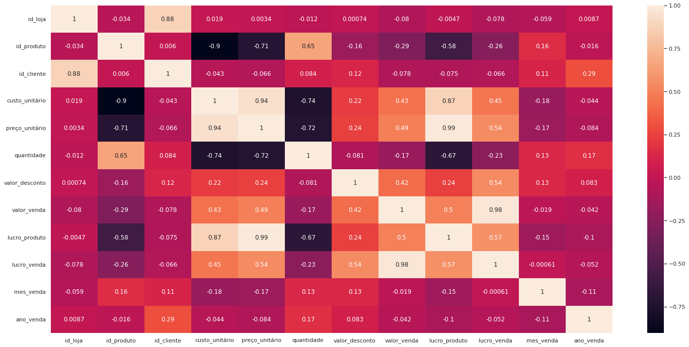
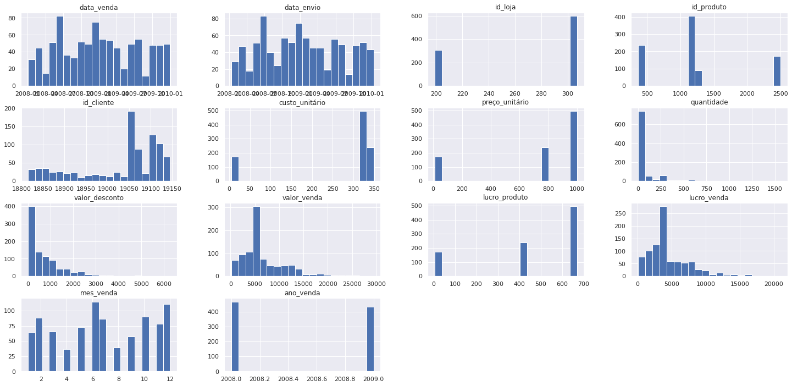
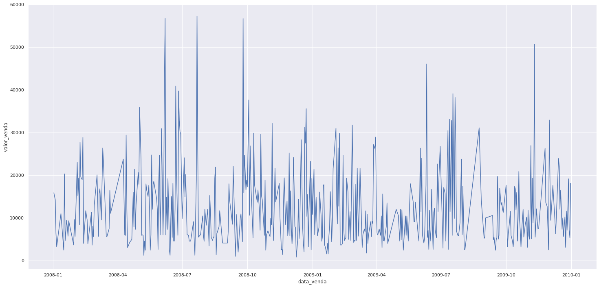
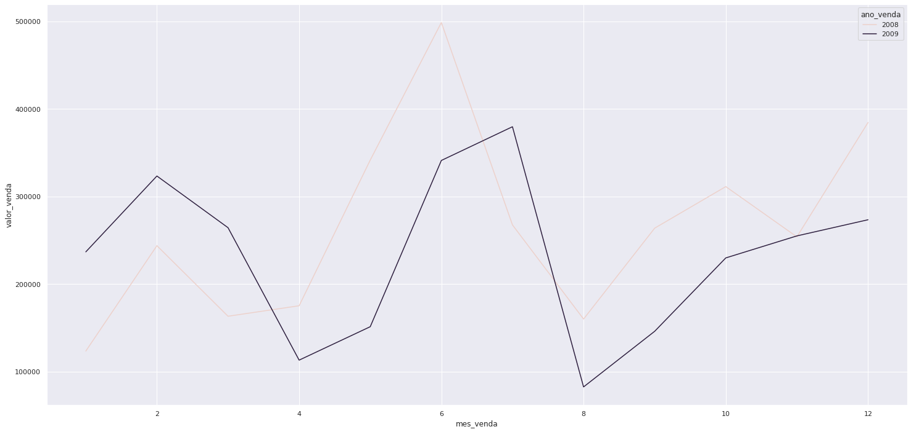
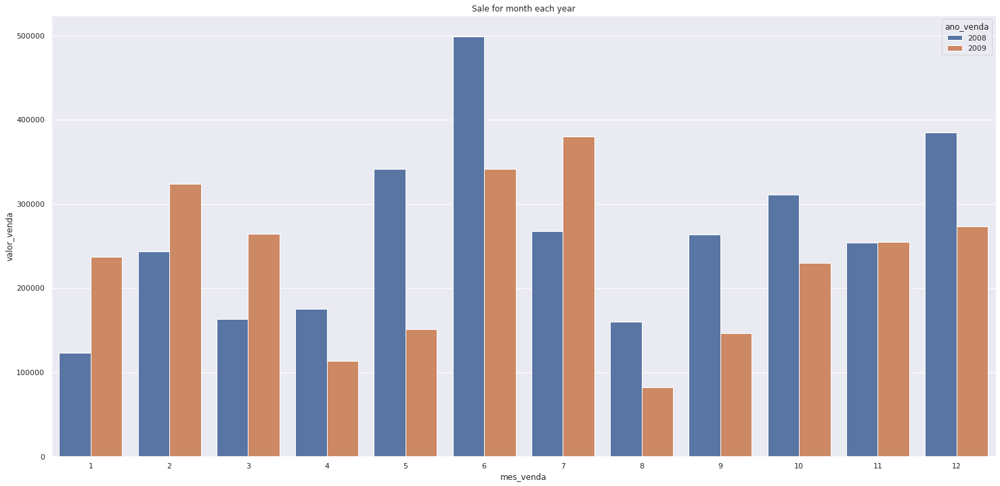

# Adventure Works Cycles Business Analysis

> The AdventureWorks Database supports a fictional manufacturing company called Adventure Works Cycles

Amostra

|Numbers of Line Registers|Numbers of Columns|Dimentionality
|----|----|-----
|904 | 16 | 14464

## Exploratory Data Analysis

### Business Questions

1. What are the best three profit products.
2. What are the worst three profit products.
3. What is the best store sale.
4. What relationship between profit and others variables.
5. What product is more sold.
6. What is the average ticket price.
7. What client take more profit.

#### 4.1.1 - What are the best three profit products.


```python

```


<div>
<table border="1" class="dataframe">
  <thead>
    <tr style="text-align: right;">
      <th></th>
      <th>produto</th>
      <th>lucro_produto</th>
    </tr>
  </thead>
  <tbody>
    <tr>
      <th>0</th>
      <td>Fabrikam Trendsetter 1/3'' 8.5mm X200 Black</td>
      <td>668.01</td>
    </tr>
    <tr>
      <th>1</th>
      <td>Fabrikam Trendsetter 1/3'' 8.5mm X200 Grey</td>
      <td>667.34</td>
    </tr>
    <tr>
      <th>2</th>
      <td>Fabrikam Trendsetter 1/3'' 8.5mm X200 White</td>
      <td>667.34</td>
    </tr>
  </tbody>
</table>
</div>


#### 4.1.2 - What are the worst three profit products.


```python

```


<div>

<table border="1" class="dataframe">
  <thead>
    <tr style="text-align: right;">
      <th></th>
      <th>produto</th>
      <th>lucro_produto</th>
    </tr>
  </thead>
  <tbody>
    <tr>
      <th>0</th>
      <td>Headphone Adapter for Contoso Phone E130 Silver</td>
      <td>4.90</td>
    </tr>
    <tr>
      <th>1</th>
      <td>Headphone Adapter for Contoso Phone E130 White</td>
      <td>4.90</td>
    </tr>
    <tr>
      <th>2</th>
      <td>Adventure Works Laptop15.4W M1548 Black</td>
      <td>409.42</td>
    </tr>
  </tbody>
</table>
</div>


#### 4.1.3 - What is the best store sale.


```python

```


<div>
<table border="1" class="dataframe">
  <thead>
    <tr style="text-align: right;">
      <th></th>
      <th>id_loja</th>
      <th>valor_venda</th>
    </tr>
  </thead>
  <tbody>
    <tr>
      <th>0</th>
      <td>199</td>
      <td>2,181,104.09</td>
    </tr>
    <tr>
      <th>1</th>
      <td>307</td>
      <td>2,079,648.44</td>
    </tr>
    <tr>
      <th>2</th>
      <td>306</td>
      <td>1,723,853.61</td>
    </tr>
  </tbody>
</table>
</div>


#### 4.1.4 - What relantionshipp between profit, sale with others variables.

You can see that 'valor_venda' has goo relationship with 'preco_unitario', 'cursto_unitario' and 'valor desconto'


```python

```


    

    


#### 4.1.5 - Which product most billing.


```python

```


<div>

<table border="1" class="dataframe">
  <thead>
    <tr style="text-align: right;">
      <th></th>
      <th>produto</th>
      <th>valor_venda</th>
    </tr>
  </thead>
  <tbody>
    <tr>
      <th>0</th>
      <td>Fabrikam Trendsetter 2/3'' 17mm X100 Grey</td>
      <td>961,037.00</td>
    </tr>
    <tr>
      <th>1</th>
      <td>Fabrikam Trendsetter 2/3'' 17mm X100 Black</td>
      <td>821,396.80</td>
    </tr>
    <tr>
      <th>2</th>
      <td>Fabrikam Trendsetter 1/3'' 8.5mm X200 Black</td>
      <td>799,809.39</td>
    </tr>
    <tr>
      <th>3</th>
      <td>Fabrikam Trendsetter 1/3'' 8.5mm X200 Grey</td>
      <td>781,334.20</td>
    </tr>
    <tr>
      <th>4</th>
      <td>Adventure Works Laptop15.4W M1548 Black</td>
      <td>746,789.18</td>
    </tr>
  </tbody>
</table>
</div>


#### 4.1.6 - What is the average ticket price.

The Avarega Ticket Price is $ **6620.14** per purchase


```python

```


    6620.14


#### 4.1.7 - What client take more profit.


```python

```


<div>

<table border="1" class="dataframe">
  <thead>
    <tr style="text-align: right;">
      <th></th>
      <th>id_cliente</th>
      <th>lucro_venda</th>
    </tr>
  </thead>
  <tbody>
    <tr>
      <th>0</th>
      <td>19052</td>
      <td>105,217.26</td>
    </tr>
    <tr>
      <th>1</th>
      <td>19094</td>
      <td>104,220.21</td>
    </tr>
    <tr>
      <th>2</th>
      <td>19062</td>
      <td>99,563.51</td>
    </tr>
    <tr>
      <th>3</th>
      <td>19060</td>
      <td>93,521.98</td>
    </tr>
    <tr>
      <th>4</th>
      <td>19106</td>
      <td>85,630.20</td>
    </tr>
  </tbody>
</table>
</div>


### 4.2 - General Exploratory Data

- There are breakdown sales in some dates
- there are only three stores and small kind of products
- There are clients that purchase a lot more of others, especially with the rightest id_client number


```python

```


    

    


As you can see, the sale allong the year from 2008 to 2009 down


```python

```


    

    


```python

```


    

    


```python

```


    Text(0.5, 1.0, 'Sale for month each year')


    

    


```python

```


    

    

